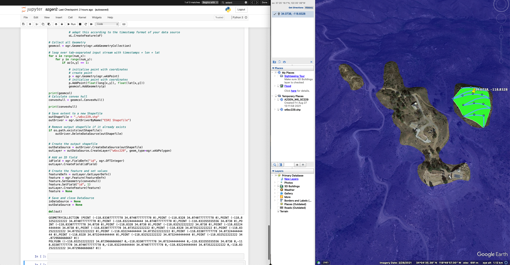

# Activation Zone Generator (azgen)
Generates a SOTA summit Activation Zone using an input latitude, longitude and altitude from the SOTA database. 
User must manually input these parameters to the iPython Notebook.

The activation zones generated by this program are slighly conservative, so the actual activation zone may be a little larger than what azgen calculates.



# Dependencies
1. iPython
2. Python Libraries
```
pip install ee
pip install osgeo
pip install gdal
pip install elevation
```

# Instructions

1. Open "azgen.ipynb"
2. Update the following parameters using data from [https://summits.sota.org.uk](https://summits.sota.org.uk) or [https://sotl.as/](https://sotl.as/). Altitude must be in units of meters.
```
summit_ref = "W6SC229"    # SOTA Summit Reference (no slashes or dash)
summit_lat = 34.0738      # Latitude in degrees (Source: SOTA Database)
summit_long = -118.8328   # Longitude in degrees (Source: SOTA Database)
summit_alt = 764          # Altitude in meters (Source: SOTA Database)
```
3. Import the output `.shp` file in `/data` into Google Maps or your GIS program of choice

# Credits
Special thanks to @thedeltaflyer for setting up the API backend and @eheinrich for productionizing the frontend!